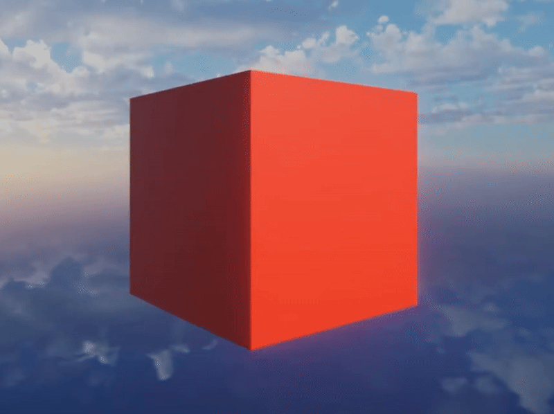
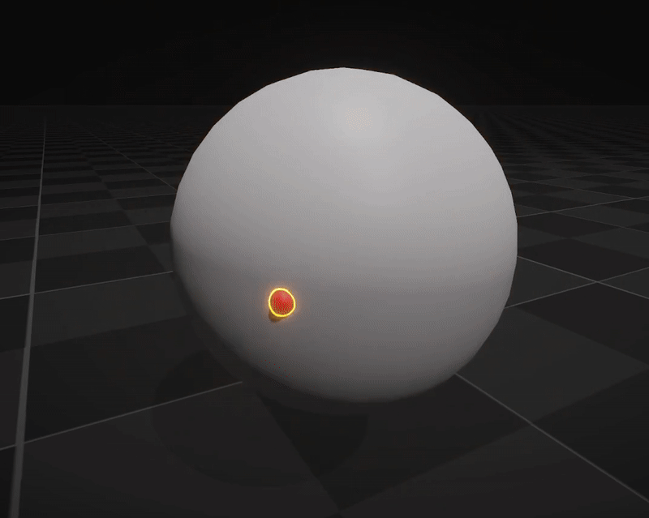
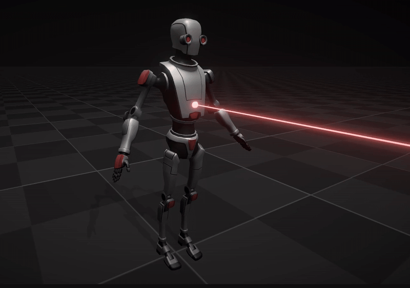
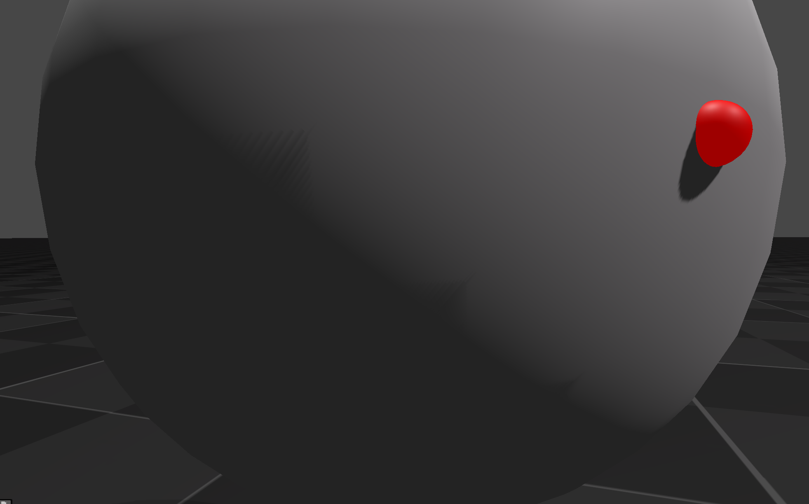
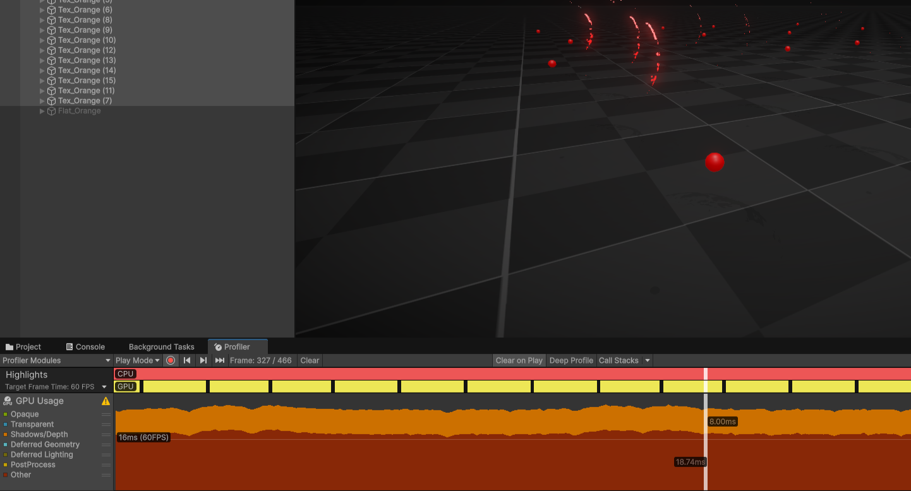
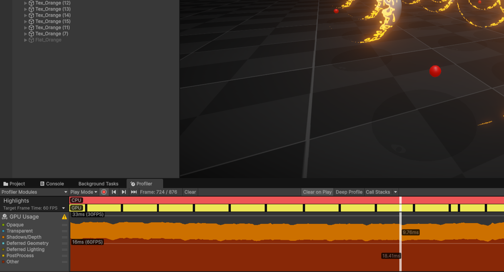

# DissolveFromPoint - Unity URP Lit Shader Effect

## Description
This shader dissolves an object outward from a given point using 3D noise.

Most examples I found of shader effects that dissolve a rendered object do so by mapping stepped/clipped noise onto an object's UV. This works fine in some cases, but the object appears to dissolve from all sides at once and the UV borders will cause strange artifacts.

The goal of this shader is to remedy these issues, granting a more visually appealing effect and potentially improving player satisfaction if implemented in a game.

### "Typical" Dissolve

  

(Rigor Mortis Tortoise - https://www.youtube.com/watch?v=U60U9KC7jxk)

### DissolveFromPoint

  

### DissolveFromPoint (in action!)

  

(RIP Robot Kyle - https://assetstore.unity.com/packages/3d/characters/robots/robot-kyle-urp-4696?srsltid=AfmBOoq8FOM60zuXhY91WQhW4E78M5Aol39jgiMvfrmJVSm0HjJS35Vo)

## Features
- Fully URP Lit (Forward/Forward+)
- Customizable & Extendable
- High-Quality Shadows
- HLSL and Shadergraph Versions

## HLSL vs ShaderGraph
This repository contains both a HLSL (preferred) and shader graph version of the shader. The shader graph version is purely for educational purposes. Tt uses UVs for noise (causing artifacts on edges) and has lower-quality shadows than the HLSL version.

### Shader Graph Shadow Artifacts

  

### Shader Graph Performance
Note that the shader graph version seems to have a slight edge in performance. This could be due to any number of reasons including noise calculations, shadow calculations, and Unity's built-in optimizations. The HLSL version is still preferred for reasons listed above.

  

### HLSL Performance

  

## Notes
- The noise function used in the HLSL shader is taken from "Packages/com.unity.visualeffectgraph/Shaders/VFXNoise.hlsl", meaning this package must be installed for it to work. It is also fairly simple to replace this with a different noise function, I just used that one for convenience.
- This shader was created and tested in Unity URP Version 6000.0.44f1, functionality in other versions isn't guaranteed.
- Thank you for checking out my shader, feel free to email me at rrattusss@gmail.com
